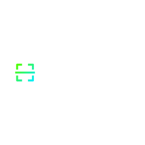

# Supporters

## Major Supporters and Sponsors

This initiative would not have been possible without the support of our sponsors and the resources they have provided. We would like to express our gratitude to the following for their support.

### CredShields

    
    

The Smart Contract Security Verification Standard (SCSVS) project was established to share insights and best practices derived from extensive research into smart contract security. We extend our gratitude to the CredShields team for their invaluable contributions in defining the initial requirements and launching this important initiative.
